> [!NOTE]
> (From CoCoA notes)
> `v4.11.1` benchmark: do not include CAMB (or the Hybrid Emulator); **Includes TATT in** ($\xi_{\pm}, \gamma_t$) **and non-limber in** $w_{gg}(\theta)$.
> CLOE-LIB caveat: We were not able to make TATT work on CloeLib. We were also not able to speed-up cloelib with `OMP_NUM_THREADS` flag
>
> CPU: `Intel(R) Core(TM) i9-10940X CPU @ 3.30GHz` (`1/8 OpenMP cores`). *Times are approximate*.
>
> - **LSST-Y1-Real 3x2pt**: (CoCoA) `0.29/0.06s`, (DESC-CCL)`7.96/1.72s`, (CLOE-LIB) 0.23/0.23s. **CoCoA speed-up (CCL)**: `27/28x`
> - **Roman-Real 3x2pt**: (CoCoA) `0.45/0.095s`, (DESC-CCL) `8.17/1.96s`, (CLOE-LIB) 0.27/0.27s. **CoCoA speed-up (CCL)**: `18/20x`
> - **Roman-Fourier 3x2pt**:  (CoCoA) `0.08/0.03s`, (DESC-CCL) `0.65/0.36s`. **CoCoA speed-up**: `7.5/21x`
> - **DES-Y3xPlanck 6x2pt**  (CoCoA) `0.40/0.075s`
> - **DES-Y3-Real 3x2pt (des_y3 repo)**  (CoCoA)~`0.25/0.05s`
> 

# CoCoA vs DESC-CCL: real-space 3x2pt code comparison

CoCoA `v5.02` and DESC-CCL compute the real-space 3x2pt data vectors of
LSST-Y1 and Roman-Real at five cosmologies, from the same CAMB tables: cosmic
shear $`\xi_\pm`$, galaxy-galaxy lensing $`\gamma_t`$ and galaxy clustering
$`w(\theta)`$. Scripts, tables and figures:
[`cocoa_comparison/`](cocoa_comparison).

Contents:
1. [Summary](#ccl_summary)
2. [Setup](#ccl_method)
3. [Results](#ccl_results)
4. [Why galaxy-galaxy lensing and clustering differ](#ccl_fkem)
5. [Figures](#ccl_figures)
6. [TATT intrinsic alignments](#ccl_tatt)
7. [Execution time (macOS, 8 cores)](#ccl_time)
8. [What it took to run DESC-CCL](#ccl_run)
9. [Reproduce](#ccl_reproduce)
10. [Appendix](#ccl_appendix)

## Summary <a name="ccl_summary"></a>

The codes are compared with

```math
\Delta\chi^2 = (d_{\rm CCL} - d_{\rm CoCoA})^{T}\, C^{-1}\, (d_{\rm CCL} - d_{\rm CoCoA}),
```

where $`d`$ is the data vector and $`C`$ the project's covariance, both
restricted to the project's mask. For scale, CoCoA's own tests pass when two
runs of one code differ by $`\Delta\chi^2 < 0.2`$. The study quotes that
number as a scale, not as a cross-code acceptance criterion.

The fiducial cosmologies of the two projects differ only in the dark-energy
equation of state: $`w = -0.9`$ in LSST-Y1, $`w = -1`$ in Roman-Real. The
last two rows run both projects at both values.

| data vector and cosmology (NLA) | $`\Delta\chi^2`$ DESC-CCL vs CoCoA, LSST-Y1 | $`\Delta\chi^2`$ DESC-CCL vs CoCoA, Roman-Real |
|---|---|---|
| 3x2pt, fiducial cosmology | 8.76 | 0.228 |
| 3x2pt, smallest of the five cosmologies | 6.56 | 0.166 |
| 3x2pt, largest of the five cosmologies | 10.50 | 0.291 |
| $`\xi_\pm`$ only, fiducial cosmology | 0.0013 | 0.058 |
| $`\gamma_t`$ only, fiducial cosmology | 7.29 | 0.269 |
| $`w(\theta)`$ only, fiducial cosmology | 6.26 | 0.096 |
| 3x2pt, $`w = -0.9`$, other parameters fiducial | 8.76 | 7.57 |
| 3x2pt, $`w = -1`$, other parameters fiducial | 0.34 | 0.228 |

1. Cosmic shear agrees in both projects: $`\Delta\chi^2 = 0.0013`$
   (LSST-Y1) and $`\Delta\chi^2 = 0.058`$ (Roman-Real) in $`\xi_\pm`$.
2. Galaxy-galaxy lensing and clustering differ in LSST-Y1. DESC-CCL's
   non-Limber method (FKEM) subtracts two terms that should cancel at high
   $`\ell`$, but computes them with different linear power spectra
   ([Section 4](#ccl_fkem)).
3. The difference follows $`w`$, not the survey: at $`w = -0.9`$ both
   projects differ by $`\Delta\chi^2 \ge 7.57`$, at $`w = -1`$ both by
   $`\Delta\chi^2 \le 0.34`$ (last two rows).
4. With TATT intrinsic alignments the TATT terms agree: $`\xi_\pm`$ differ
   by $`\Delta\chi^2 = 0.0018`$ (LSST-Y1) and $`\Delta\chi^2 = 0.058`$
   (Roman-Real) ([Section 6](#ccl_tatt)).
5. This repository's DESC-CCL benchmark scripts model the data vector
   differently from CoCoA: $`\Delta\chi^2 = 154`$ (LSST-Y1) and
   $`\Delta\chi^2 = 56`$ (Roman-Real) ([Appendix](#ccl_appendix_modeling)).

## Setup <a name="ccl_method"></a>

Both codes receive the same tables at each cosmology; DESC-CCL reads them
through `pyccl.CosmologyCalculator`. No Boltzmann or background difference
enters.

| table (CAMB, computed in Cocoa) | range |
|---|---|
| linear and nonlinear $`P(k,z)`$ | $`z \le 6`$, $`10^{-5} \le k \le 200\ {\rm Mpc}^{-1}`$ |
| comoving distance $`\chi(z)`$, and $`H(z)`$ from $`d\chi/dz`$ | $`z \le 50`$ |
| growth factor $`D(z) = \sqrt{P_{\rm lin}(k_0, z)/P_{\rm lin}(k_0, 0)}`$ with $`k_0 = 5\times 10^{-4}\ {\rm Mpc}^{-1}`$, and $`f = d\ln D/d\ln a`$ | $`z \le 49`$ |

| setting | LSST-Y1 | Roman-Real |
|---|---|---|
| angular bins | 26 log bins, 2.5' to 900' | 15 log bins, 2.5' to 250' |
| mask | `lsst_y1_M1_GGLOLAP0.05.mask` (959 of 1560 points) | `example1.mask` (1950 of 2115 points) |
| $`\gamma_t`$ pairs CoCoA excludes (lens, source) | none | (7, 1), (8, 1), (8, 2) |
| $`\ell_{\max}`$ (CoCoA's `lmax`) | $`6.5\times10^4`$ | $`10^5`$ |
| likelihood settings | `EXAMPLE_EVALUATE2.yaml` | `EXAMPLE_EVALUATE2.yaml` |

The model is NLA intrinsic alignments and a linear galaxy bias $`b_1`$ per
lens bin. Photo-z shifts, shear calibration, magnification and point masses
are set to zero, and baryons are off. Bins count from 1 in the text and the
figures.

Cosmologies:

    fiducial:  As = 2.1e-9, ns = 0.96605, H0 = 67.32, omegam = 0.3, omegab = 0.04, mnu = 0.06 eV
               w = -0.9 (LSST-Y1), w = -1 (Roman-Real)
    omm_lo:    omegam = 0.25 (As fixed)
    omm_hi:    omegam = 0.35 (As fixed)
    ns_lo:     ns = 0.92
    ns_hi:     ns = 1.01
    w_m1:      LSST-Y1 with w = -1 (Roman-Real's fiducial value)
    w_m09:     Roman-Real with w = -0.9 (LSST-Y1's fiducial value)

DESC-CCL reference settings:

    pyccl:        build of LSSTDESC/CCL PR #1296, commit 647ad4a (full-sky xi+-, bin averaging)
    angular_cl:   l_limber=150, non_limber_integration_method="FKEM", fkem_Nchi=2000 (C_gg and C_gs)
    ell:          every integer from 2 to 400, then 1500 log-spaced values to lmax (also ELL_MAX_CORR)
    correlation:  theta=lower bin edges, theta_max=upper bin edges, method="legendre"

| convention | CoCoA | DESC-CCL setting |
|---|---|---|
| $`n(z)`$ files | first column is the bin's lower edge | `dndz` at $`z + \Delta z/2`$ |
| NLA | $`A_1[(1+z)/1.62]^{\eta}\,C_1\rho_{\rm crit}\,\Omega_m/D`$, $`C_1\rho_{\rm crit} = 0.01389`$ | `ia_bias` $`\times\ 0.01389/(5\times10^{-14}\rho_{\rm crit})`$, `use_A_ia=True` |
| galaxy bias | $`b_1`$ per lens bin | `bias=(z, b1)` |
| non-Limber | $`\ell < 150`$ in $`C_{gg}`$ and $`C_{gs}`$ | `l_limber=150`, FKEM |
| RSD | in $`C_{gg}`$ only (`include_RSD_GS: 0`) | `has_rsd=True` in the $`w(\theta)`$ tracer, `False` in the $`\gamma_t`$ tracer |
| real space | full-sky Legendre sums, bin-averaged | PR #1296, `method="legendre"` with `theta_max` |

DESC-CCL's `has_rsd` adds RSD to every correlation of a tracer, so the
$`\gamma_t`$ lens tracer is a second tracer without RSD. With RSD also in
$`\gamma_t`$, DESC-CCL's $`\gamma_t`$ moves by $`\Delta\chi^2 = 0.36`$
(LSST-Y1) and $`\Delta\chi^2 = 0.076`$ (Roman-Real).

## Results <a name="ccl_results"></a>

$`\Delta\chi^2`$ between DESC-CCL (reference settings) and CoCoA, NLA:

LSST-Y1:

| cosmology | $`\Delta\chi^2`$ 3x2pt | $`\Delta\chi^2`$ $`\xi_\pm`$ only | $`\Delta\chi^2`$ $`\gamma_t`$ only | $`\Delta\chi^2`$ $`w(\theta)`$ only |
|---|---|---|---|---|
| fiducial | 8.76 | 0.0013 | 7.29 | 6.26 |
| $`\Omega_m = 0.25`$ | 6.56 | 0.0005 | 4.87 | 5.48 |
| $`\Omega_m = 0.35`$ | 10.50 | 0.0032 | 9.44 | 6.46 |
| $`n_s = 0.92`$ | 9.07 | 0.0013 | 7.56 | 6.55 |
| $`n_s = 1.01`$ | 8.45 | 0.0014 | 7.06 | 5.97 |

Roman-Real:

| cosmology | $`\Delta\chi^2`$ 3x2pt | $`\Delta\chi^2`$ $`\xi_\pm`$ only | $`\Delta\chi^2`$ $`\gamma_t`$ only | $`\Delta\chi^2`$ $`w(\theta)`$ only |
|---|---|---|---|---|
| fiducial | 0.228 | 0.058 | 0.269 | 0.096 |
| $`\Omega_m = 0.25`$ | 0.166 | 0.023 | 0.193 | 0.087 |
| $`\Omega_m = 0.35`$ | 0.291 | 0.123 | 0.360 | 0.098 |
| $`n_s = 0.92`$ | 0.236 | 0.055 | 0.280 | 0.099 |
| $`n_s = 1.01`$ | 0.215 | 0.055 | 0.259 | 0.091 |

A per-probe column keeps only that probe's entries of
$`d_{\rm CCL} - d_{\rm CoCoA}`$. The covariance correlates the probes, so
the per-probe columns do not add up to the 3x2pt column. Roman-Real leaves
out the pair (lens 8, source 3), which DESC-CCL cannot transform
([Appendix](#ccl_appendix_fail)).

One change at a time, fiducial cosmology, 3x2pt $`\Delta\chi^2`$:

| row | comparison | 3x2pt $`\Delta\chi^2`$, LSST-Y1 | 3x2pt $`\Delta\chi^2`$, Roman-Real |
|---|---|---|---|
| 1 | CoCoA default vs CoCoA high accuracy (`accuracyboost: 2`, `integration_accuracy: 1`) | 0.004 | 0.007 |
| 2 | DESC-CCL reference vs DESC-CCL finer sampling (`fkem_Nchi=4000`, 3000 log $`\ell`$) | 0.0014 | 0.0002 |
| 3 | DESC-CCL default sampling (`fkem_Nchi` default, 500 log $`\ell`$) vs DESC-CCL reference | 0.34 | 0.0005 |
| 4 | CoCoA's Limber $`C_\ell`$ through DESC-CCL's transform vs CoCoA, both in Limber | 0.009 | 0.0006 |
| 5 | DESC-CCL vs CoCoA, both in Limber | 0.16 | 0.031 |
| 6 | DESC-CCL given a separable linear $`P(k,z)`$ (diagnostic, [Section 4](#ccl_fkem)) vs CoCoA | 0.21 | 0.062 |
| 7 | DESC-CCL vs CoCoA | 8.76 | 0.228 |

1. Rows 1 and 2: each code is converged at its settings.
2. Row 3: DESC-CCL's default sampling is not converged in LSST-Y1 (in
   $`w(\theta)`$); every DESC-CCL run here uses the reference sampling.
3. Row 4: the real-space transforms agree.
4. Row 5: the Limber $`C_\ell`$ agree ([Appendix](#ccl_appendix_cl)).
5. Rows 6 and 7: the non-Limber term carries the difference.

## Why galaxy-galaxy lensing and clustering differ <a name="ccl_fkem"></a>

Below $`\ell = 150`$, both codes compute $`C_{gs}`$ and $`C_{gg}`$ beyond
the Limber approximation as the Limber result plus a linear-theory
correction:

```math
C_\ell = C_\ell^{\rm Limber}[P_{\rm nl}] + C_\ell^{\rm exact}[P_{\rm lin}] - C_\ell^{\rm Limber}[P_{\rm lin}].
```

The last two terms cancel where Limber is accurate, but only if both use the
same linear spectrum. The exact term uses FFTLog, which needs a spectrum
separable in $`k`$ and $`z`$: a growth factor squared times one fixed
$`P_{\rm lin}(k)`$.

| code | $`P_{\rm lin}`$ in $`C_\ell^{\rm exact}`$ | $`P_{\rm lin}`$ in $`C_\ell^{\rm Limber}[P_{\rm lin}]`$ |
|---|---|---|
| DESC-CCL (`pyccl/nonlimber/_nonlimber_FKEM.py`) | $`D^2(z)\,P_{\rm lin}(k, 0)`$ | CAMB's $`P_{\rm lin}(k, z)`$ |
| CoCoA `v5.02` (`cosmo2D.c`) | $`[D(z)/D(z_{\rm piv})]^2\,P_{\rm lin}(k, z_{\rm piv})`$ | the same |

Here $`z_{\rm piv}`$ is the lens bin's mean redshift. When the linear growth
depends on $`k`$, $`D^2(z)\,P_{\rm lin}(k,0)`$ differs from
$`P_{\rm lin}(k,z)`$. CoCoA `v5.02` uses one spectrum in both terms, so they
cancel at the Limber limit. DESC-CCL uses two, so its terms leave an offset
in $`C_{gs}`$ and $`C_{gg}`$ below $`\ell = 150`$.

The evidence (fiducial cosmology unless a row sets $`w`$):

| check | LSST-Y1 | Roman-Real |
|---|---|---|
| fiducial $`w`$ | −0.9 | −1 |
| $`k`$ dependence of the growth: $`D(k,z)/D(k_0,z) - 1`$ for $`k`$ from 0.01 to $`0.2\ {\rm Mpc}^{-1}`$ and $`z`$ from 0.5 to 2 | +0.5% to +1.2% | +0.03% to +0.3% |
| DESC-CCL $`C_{gs}`$ below $`\ell = 150`$: $`C_\ell`$ with CAMB's table / $`C_\ell`$ with the separable table − 1 | −0.7% to −1.5% | −0.03% to −0.4% |
| DESC-CCL $`C_{gg}`$ / CoCoA $`C_{gg}`$ − 1, every lens bin, $`\ell`$ from 2 to 140 | −1.74% to −0.80% | −0.58% to +0.30% |
| 3x2pt $`\Delta\chi^2`$, DESC-CCL given the separable table vs CoCoA | 0.21 | 0.062 |
| 3x2pt $`\Delta\chi^2`$, DESC-CCL vs CoCoA, $`w = -0.9`$, other parameters fiducial | 8.76 | 7.57 |
| 3x2pt $`\Delta\chi^2`$, DESC-CCL vs CoCoA, $`w = -1`$, other parameters fiducial | 0.34 | 0.228 |

1. The LSST-Y1 $`C_{gg}`$ offset is flat in $`\ell`$. A non-Limber effect
   changes with $`\ell`$; two terms that fail to cancel leave a constant
   fraction.
2. Given CoCoA's separable table, DESC-CCL agrees with CoCoA.
3. The $`k`$ dependence of the growth is larger at $`w = -0.9`$, and so is
   the difference, in both projects (last two rows).

DESC-CCL's leftover is larger than the non-Limber effect it corrects.
$`\Delta\chi^2`$ between non-Limber and Limber $`\gamma_t`$ in one code,
LSST-Y1:

| code | $`\Delta\chi^2`$, non-Limber vs Limber $`\gamma_t`$ |
|---|---|
| CoCoA | 1.98 |
| DESC-CCL | 11.2 |
| DESC-CCL given the separable table | 2.06 |

Neither code evaluates the exact integral when the growth depends on
$`k`$. CoCoA's anchor at the lens bin's mean redshift limits the error to
the bin's redshift width; DESC-CCL's anchor at $`z = 0`$ carries it from
$`z = 0`$. Largest $`\lvert P_{\rm sep}/P_{\rm lin} - 1\rvert`$ for $`k`$
from 0.01 to $`0.2\ {\rm Mpc}^{-1}`$ over the central 90% of each lens bin's
$`n(z)`$ (`scripts/diag_anchor.py`):

| project (lowest to highest lens bin) | $`\max\lvert P_{\rm sep}/P_{\rm lin} - 1\rvert`$, anchor at $`z = 0`$ (DESC-CCL) | $`\max\lvert P_{\rm sep}/P_{\rm lin} - 1\rvert`$, anchor at the lens bin's mean redshift (CoCoA) |
|---|---|---|
| LSST-Y1 | 1.0% to 1.9% | 0.15% to 0.28% |
| Roman-Real | 0.16% to 0.96% | 0.05% to 0.21% |

The study measures the difference between the codes, not either code's
distance from the exact $`C_\ell`$.

## Figures <a name="ccl_figures"></a>

Each panel shows $`(d_{\rm CCL} - d_{\rm CoCoA})/\sigma`$ with
$`\sigma = \sqrt{C_{ii}}`$ from the project's covariance, one curve per
cosmology.

> [!NOTE]
> $`\sigma = \sqrt{C_{ii}}`$ uses only the diagonal of the covariance. A
> point at 1 is a one-sigma difference for that point alone, ignoring its
> correlations with every other point. The $`\Delta\chi^2`$ of the tables
> uses the full covariance, so the figures do not add up to it.

1. Each row of panels has its own y-range.
2. A panel marked $`1/\alpha = f`$ shows the difference divided by $`f`$;
   multiply what its axis reads by $`f`$.
3. Panel labels are $`\gamma_t`$ (lens, source), $`w(\theta)`$ (lens) and
   $`\xi_\pm`$ (source $`i`$, source $`j`$).
4. LSST-Y1 shows every $`\theta`$; its $`\Delta\chi^2`$ uses the mask.
   Roman-Real leaves the masked points blank.
5. The maxima below are over the five cosmologies and every plotted point.

**LSST-Y1, $`\gamma_t`$.** At most $`\lvert\Delta\gamma_t\rvert/\sigma = 0.53`$,
near 100'. This is the FKEM offset of [Section 4](#ccl_fkem), with the same
shape at every cosmology.

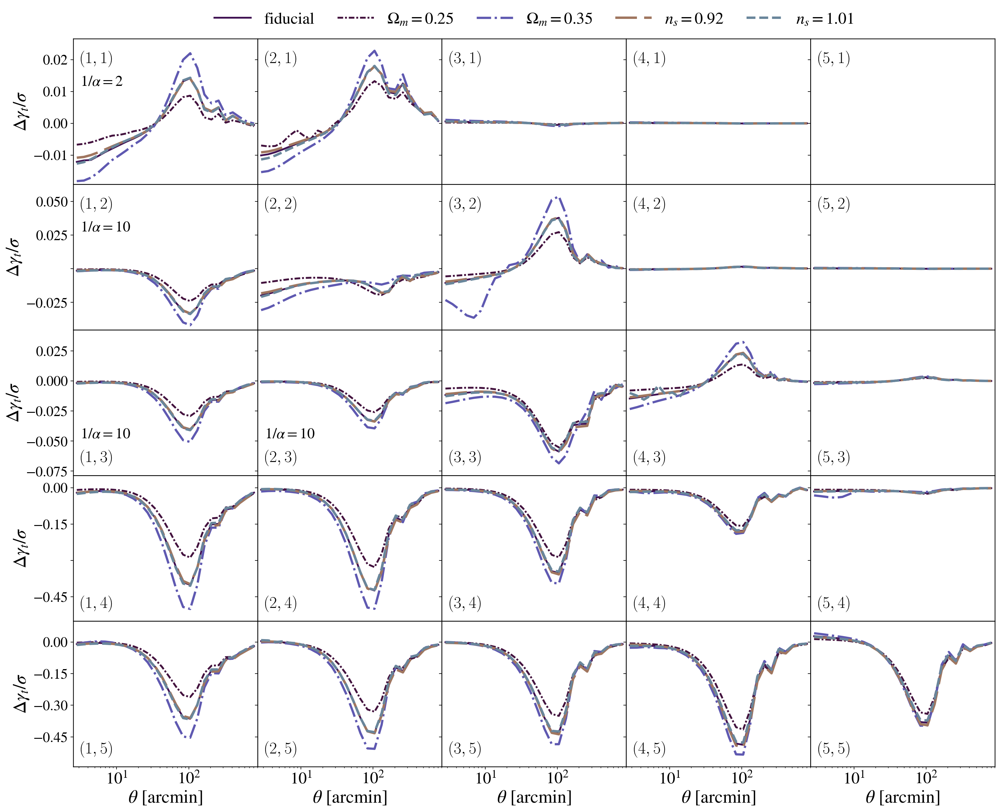

**LSST-Y1, $`w(\theta)`$.** The same offset: $`\Delta w/\sigma`$ from −0.3
to −1.39 below 100', and at most $`\lvert\Delta w\rvert/\sigma = 0.89`$ on
the points the mask keeps.

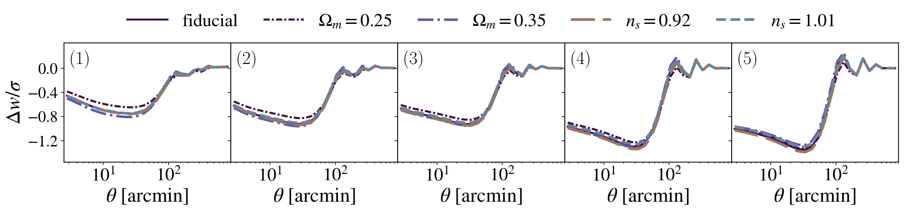

**LSST-Y1, $`\xi_+`$ and $`\xi_{-}`$.** At most
$`\lvert\Delta\xi_+\rvert/\sigma = 0.014`$ and
$`\lvert\Delta\xi_{-}\rvert/\sigma = 0.010`$.

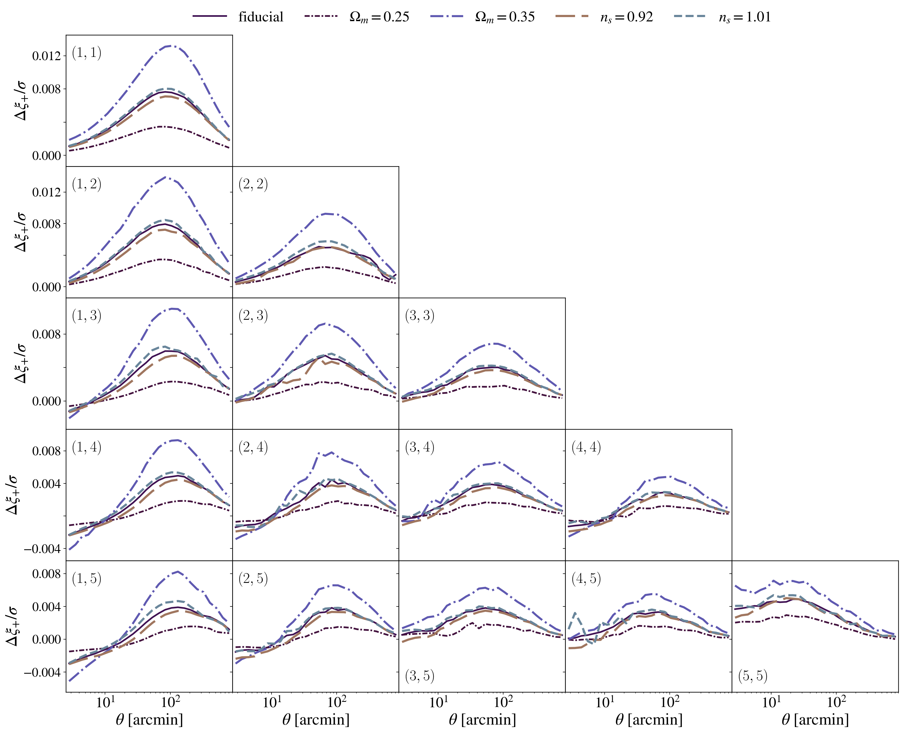
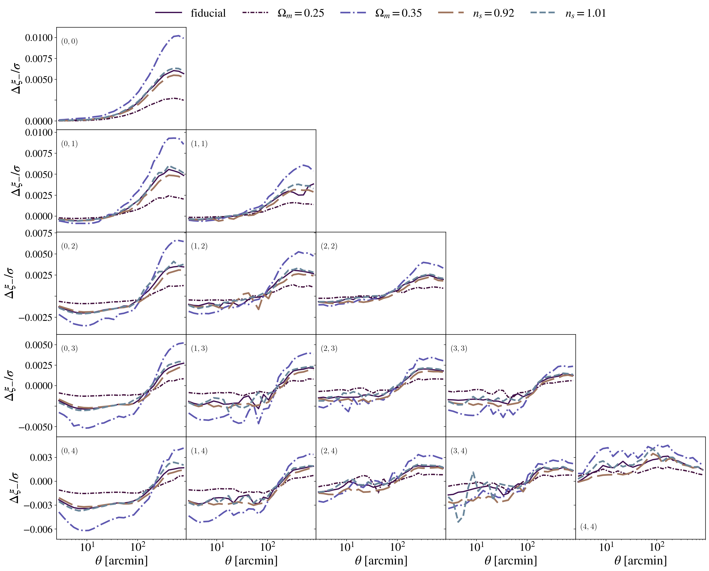

**Roman-Real, $`\gamma_t`$.** At most
$`\lvert\Delta\gamma_t\rvert/\sigma = 0.045`$. Panels marked "excluded" are
CoCoA's $`\gamma_t`$ exclusions. Panels marked "lens behind source" are
left blank: there the lens bin lies behind the source bin, and CoCoA's
$`\gamma_t/\sigma < 1`$ at every $`\theta`$ the mask keeps. The
$`\Delta\chi^2`$ of the tables includes them. The difference is a fraction
of the signal, so these panels carry almost none of it:
- in panel (6, 4), lens bin 6 lies behind source bin 4: CoCoA's
  $`\gamma_t/\sigma`$ is at most 0.087, and
  $`\lvert\Delta\gamma_t\rvert/\sigma < 10^{-4}`$;
- in panel (2, 6), source bin 6 lies behind lens bin 2: CoCoA's
  $`\gamma_t/\sigma`$ reaches 93, and the same fractional offset gives
  $`\lvert\Delta\gamma_t\rvert/\sigma = 0.024`$.

Panel (8, 3), which DESC-CCL cannot transform
([Appendix](#ccl_appendix_fail)), is one of the blank panels.

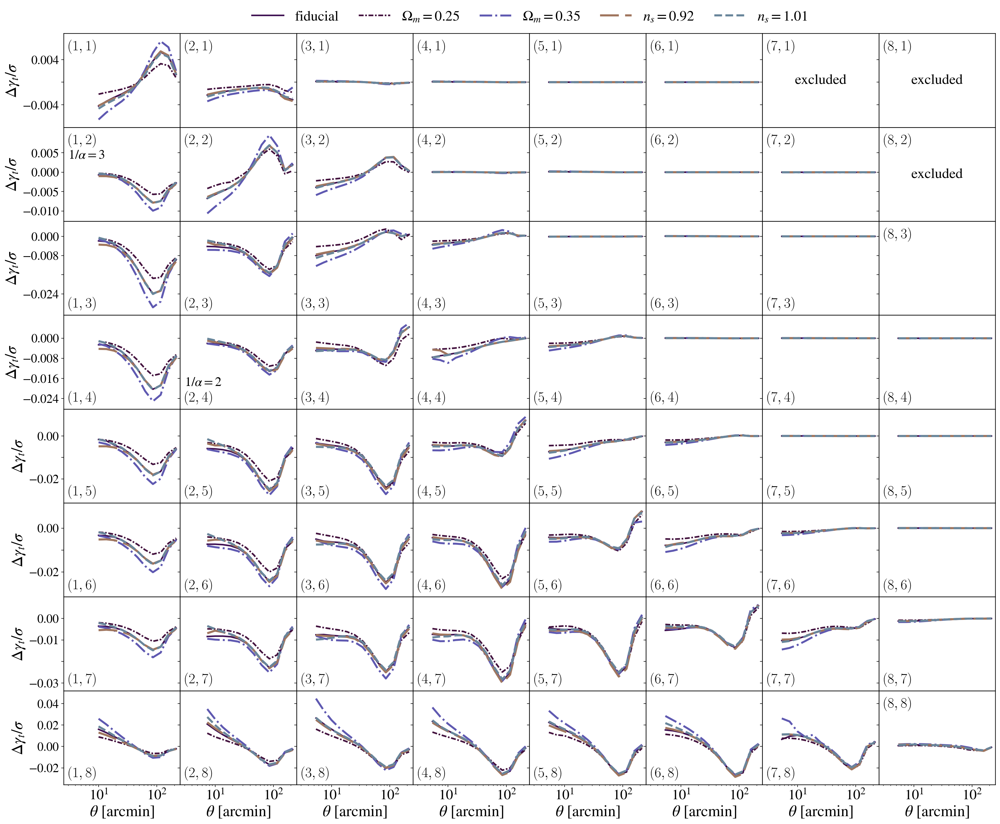

**Roman-Real, $`w(\theta)`$.** At most
$`\lvert\Delta w\rvert/\sigma = 0.088`$.

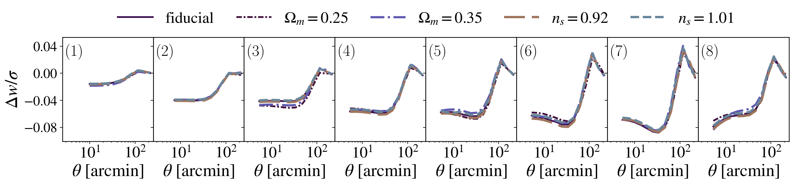

**Roman-Real, $`\xi_+`$ and $`\xi_{-}`$.** At most
$`\lvert\Delta\xi_+\rvert/\sigma = 0.050`$ and
$`\lvert\Delta\xi_{-}\rvert/\sigma = 0.059`$.

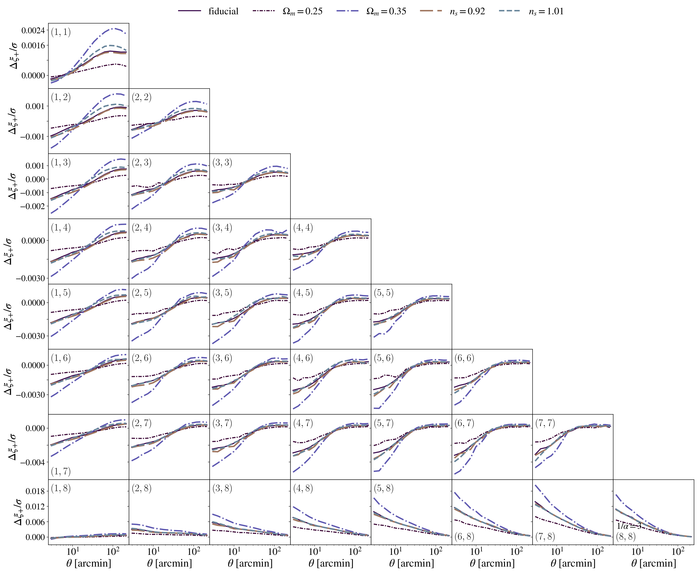
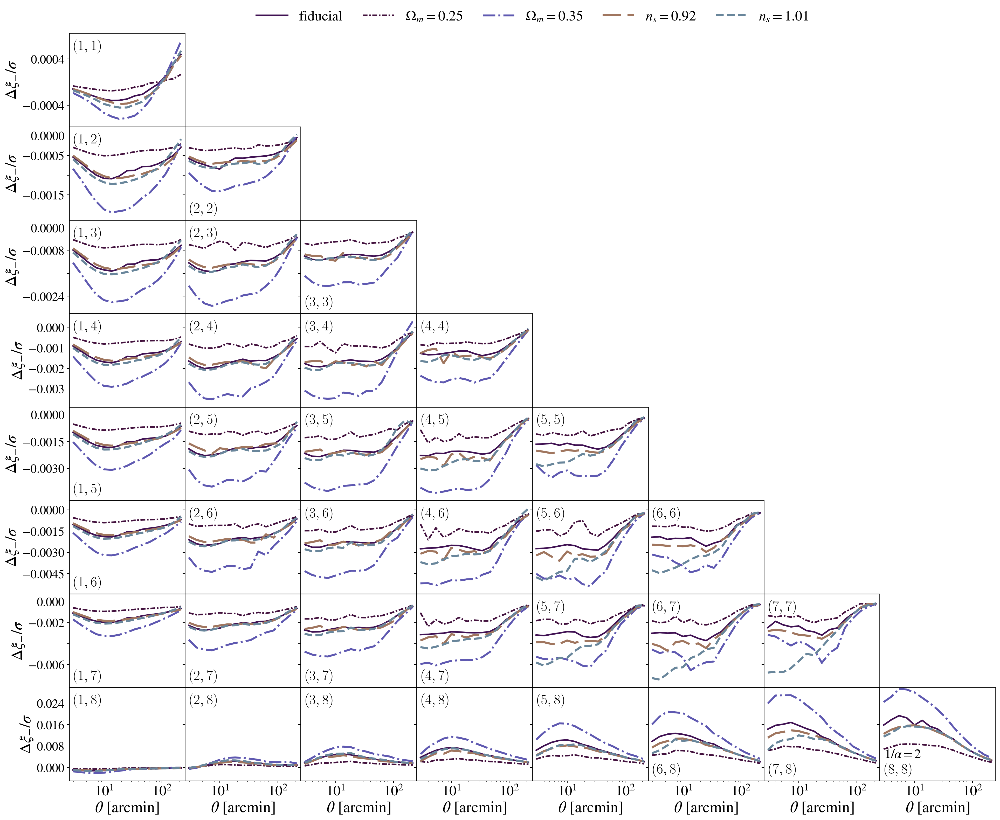

## TATT intrinsic alignments <a name="ccl_tatt"></a>

The comparison repeated with TATT intrinsic alignments at the five
cosmologies:
- CoCoA: `IA_model: 1`, TATT terms from CFASTPT (`IA_code: 0`, the C port
  of FAST-PT in cosmolike);
- DESC-CCL: `EulerianPTCalculator` (FAST-PT), variant `tatt:` of
  `ccl_compute.py`.

TATT parameters (those of this repository's benchmark scripts):

    A1: 0.7
    eta1: -1.7
    A2: -1.36
    eta2: -2.5
    bTA: 1
    pivot redshift: 0.62

The mapping of the TATT conventions between the codes is in the
[Appendix](#ccl_appendix_tatt). With $`A_2 = b_{\rm TA} = 0`$, the `tatt:`
variant reproduces the NLA reference to $`\Delta\chi^2 = 8\times10^{-5}`$.

$`\Delta\chi^2`$ between DESC-CCL (reference settings) and CoCoA, TATT:

LSST-Y1:

| cosmology | $`\Delta\chi^2`$ 3x2pt | $`\Delta\chi^2`$ $`\xi_\pm`$ only | $`\Delta\chi^2`$ $`\gamma_t`$ only | $`\Delta\chi^2`$ $`w(\theta)`$ only |
|---|---|---|---|---|
| fiducial | 8.89 | 0.0018 | 7.46 | 6.26 |
| $`\Omega_m = 0.25`$ | 6.62 | 0.0006 | 4.96 | 5.48 |
| $`\Omega_m = 0.35`$ | 10.76 | 0.0059 | 9.74 | 6.46 |
| $`n_s = 0.92`$ | 9.21 | 0.0018 | 7.74 | 6.55 |
| $`n_s = 1.01`$ | 8.59 | 0.0020 | 7.22 | 5.97 |

Roman-Real:

| cosmology | $`\Delta\chi^2`$ 3x2pt | $`\Delta\chi^2`$ $`\xi_\pm`$ only | $`\Delta\chi^2`$ $`\gamma_t`$ only | $`\Delta\chi^2`$ $`w(\theta)`$ only |
|---|---|---|---|---|
| fiducial | 0.237 | 0.058 | 0.280 | 0.096 |
| $`\Omega_m = 0.25`$ | 0.168 | 0.022 | 0.196 | 0.087 |
| $`\Omega_m = 0.35`$ | 0.306 | 0.123 | 0.378 | 0.098 |
| $`n_s = 0.92`$ | 0.244 | 0.055 | 0.291 | 0.099 |
| $`n_s = 1.01`$ | 0.222 | 0.056 | 0.269 | 0.091 |

| comparison (fiducial cosmology, TATT) | $`\Delta\chi^2`$, LSST-Y1 | $`\Delta\chi^2`$, Roman-Real |
|---|---|---|
| CoCoA TATT vs CoCoA NLA, 3x2pt (size of the TATT terms) | 1742 | 1307 |
| CoCoA TATT vs CoCoA NLA, $`\xi_\pm`$ only | 1677 | 1293 |
| CoCoA default vs CoCoA high accuracy, 3x2pt | 0.005 | 0.008 |
| DESC-CCL PT tables at 320 vs 160 $`k`$ per decade, 3x2pt | $`8\times10^{-9}`$ | $`4\times10^{-7}`$ |
| DESC-CCL vs CoCoA, both in Limber, 3x2pt | 0.159 | 0.031 |
| DESC-CCL given the separable table vs CoCoA, 3x2pt | 0.22 | 0.066 |

1. The TATT terms agree. Their size is $`\Delta\chi^2 = 1677`$ (LSST-Y1) and
   $`\Delta\chi^2 = 1293`$ (Roman-Real) in $`\xi_\pm`$, while the codes
   differ in $`\xi_\pm`$ by $`\Delta\chi^2 = 0.0018`$ and
   $`\Delta\chi^2 = 0.058`$ (NLA: 0.0013 and 0.058).
2. The 3x2pt difference is the FKEM offset of [Section 4](#ccl_fkem):
   $`\Delta\chi^2 = 8.89`$ and $`0.237`$ with TATT, $`8.76`$ and $`0.228`$
   with NLA. The separable table lowers it to $`\Delta\chi^2 = 0.22`$ and
   $`0.066`$.
3. Above $`\ell \approx 5\times10^4`$ the TATT $`C_\ell`$ differ where TATT
   dominates; this does not reach $`\xi_\pm`$ above 2.5'
   ([Appendix](#ccl_appendix_tatt)).

Figures, as in [Figures](#ccl_figures). LSST-Y1: at most
$`\lvert\Delta\xi_+\rvert/\sigma = 0.020`$,
$`\lvert\Delta\xi_{-}\rvert/\sigma = 0.010`$ and
$`\lvert\Delta\gamma_t\rvert/\sigma = 0.534`$ (the FKEM offset); its
$`w(\theta)`$ is the NLA figure.

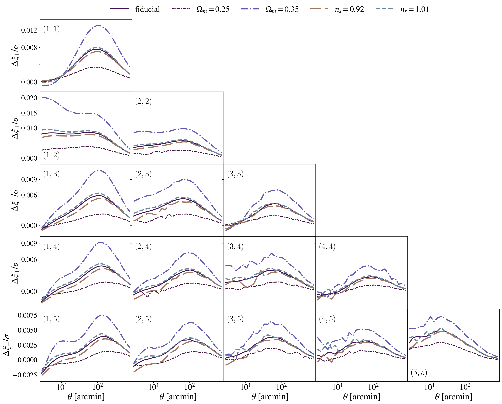
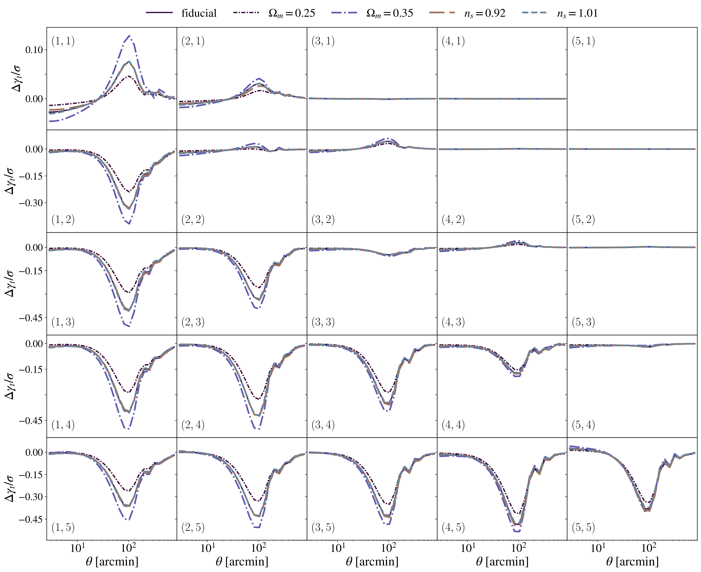

Roman-Real: at most $`\lvert\Delta\xi_+\rvert/\sigma = 0.049`$,
$`\lvert\Delta\xi_{-}\rvert/\sigma = 0.059`$ and
$`\lvert\Delta\gamma_t\rvert/\sigma = 0.045`$. The blank $`\gamma_t`$
panels follow the NLA rule on CoCoA's TATT data vector, so panel (4, 3) is
blank with TATT ($`\gamma_t/\sigma < 1`$) but not with NLA.

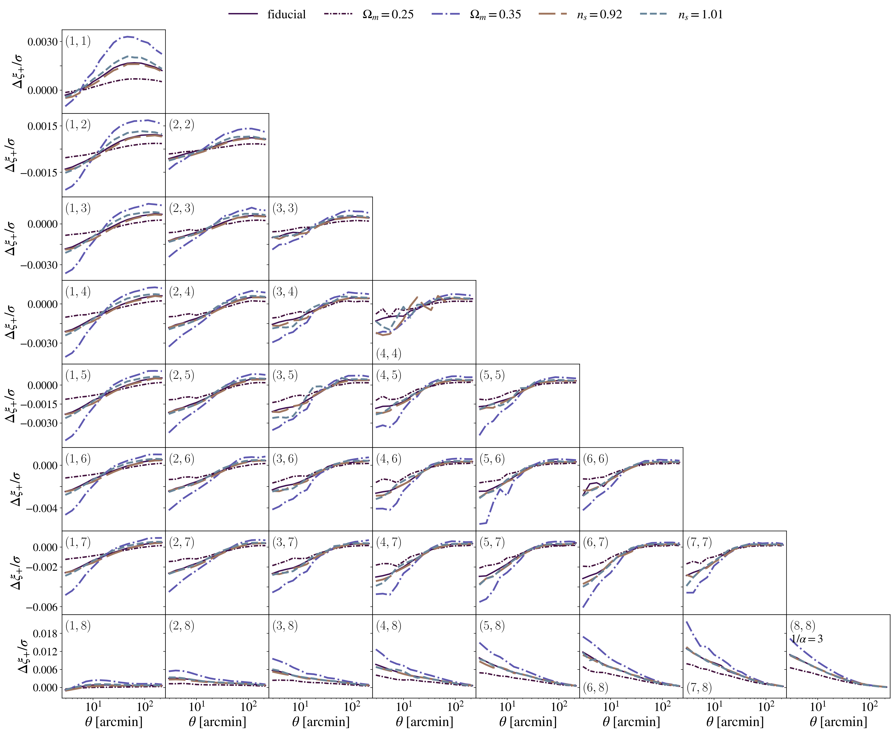
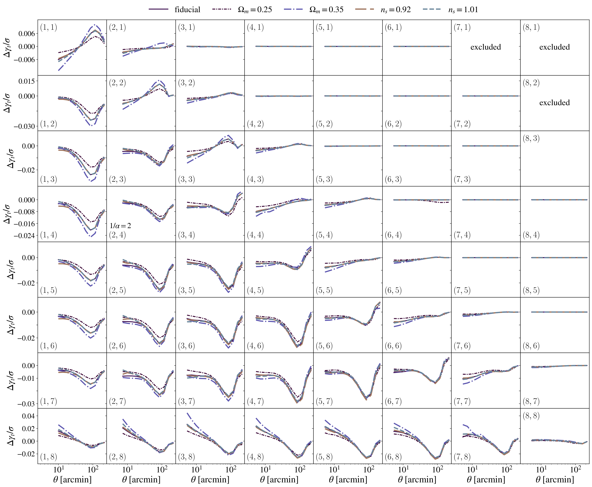

## Execution time (macOS, 8 cores) <a name="ccl_time"></a>

Time per data-vector evaluation on an Apple M2 Pro laptop (macOS 13.7.5),
8 OpenMP threads, one job on the machine:

| case | CoCoA, time per evaluation (s) | DESC-CCL, time per evaluation (s) | time ratio DESC-CCL / CoCoA |
|---|---|---|---|
| LSST-Y1, NLA | 0.046 | 10.45 | 228 |
| LSST-Y1, TATT | 0.053 | 15.41 | 292 |
| Roman-Real, NLA | 0.070 | 17.96 | 256 |
| Roman-Real, TATT | 0.076 | 22.75 | 298 |

What is timed:
1. CoCoA: Cobaya's timer of the likelihood (interpolation of the CAMB
   tables, cosmolike's data vector and $`\chi^2`$).
2. DESC-CCL: from the CAMB tables to the data vector at the reference
   sampling (`CosmologyCalculator`, tracers, the TATT PT step, every
   $`C_\ell`$, the PR #1296 transforms).
3. CAMB is excluded on both sides: both codes receive the same CAMB tables.

How it is timed:
1. Two warm-up evaluations are not timed.
2. Each timed evaluation is a new cosmology (the five models in turn).
3. CoCoA's time is the mean of 20 evaluations, DESC-CCL's the mean of 10.
4. Every evaluation is within 9% (CoCoA) and 7% (DESC-CCL) of the mean
   (`cocoa_comparison/timing_macos.txt`).

The note at the top times this repository's benchmark scripts (their
modeling, Intel CPU); this table times the configurations of this study.

## What it took to run DESC-CCL <a name="ccl_run"></a>

| symptom | cause | resolution |
|---|---|---|
| `CCLError` 1040 for full-sky $`\xi_\pm`$ | CCL 3.3 has no full-sky $`\xi_\pm`$ | pyccl built from PR #1296 (`build_ccl_pr.sh`) |
| `AttributeError` for `np.trapz` in FAST-PT 4.0.0 | NumPy 2.4 removed `np.trapz` | FAST-PT 4.1.0 (`ccldev.yml`), whose TATT data vectors match 4.0.0 bit for bit |
| `ccl_angular_cls_limber(): integration error`, Roman-Real lens bins 7 and 8 with RSD | the growth table of `cocoa_export.py` ended at $`z = 6`$ | growth from CAMB to $`z = 49`$ |
| same error, lens bin 8, $`\ell = 2`$ only | the Limber RSD kernel evaluates the background at $`\chi_{\ell+1} = \chi\,(\ell + 3/2)/(\ell + 1/2)`$, which is $`1.4\chi`$ at $`\ell = 2`$ ($`z \approx 14`$ for $`z = 4`$); `ccl_compute.py` cut CoCoA's $`\chi(z)`$ table at $`z = 10`$ | CoCoA's $`\chi(z)`$ to $`z = 50`$ |
| $`H(z)`$ off by $`3\times10^{-4}`$ above $`z = 3`$ | `np.gradient` of $`\chi(z)`$ where the $`z`$ grid coarsens | cubic-spline derivative (agrees with CCL's own $`H(z)`$ to $`10^{-5}`$) |
| Eisenstein-Hu cosmology needs $`\sigma_8`$ | the benchmark modeling uses DESC-CCL's own $`P(k)`$ | `ccl.sigma8` of the CAMB-table cosmology |
| `correlation` fails for two $`\gamma_t`$ pairs | [Appendix](#ccl_appendix_fail) | not worked around: pairs left out |

CoCoA side:
1. cosmolike reads the data files once per process, so the full data vector
   (a scratch dataset with `ones.mask`) and the masked covariance come from
   separate runs.
2. The Roman-Real covariance is not positive definite with every point, so
   Roman-Real uses its mask.
3. Cobaya returns $`\chi(z)`$ only at requested redshifts, so the export
   reads it on the likelihood's $`z`$ grid.

## Reproduce <a name="ccl_reproduce"></a>

We assume users have Conda, a Cocoa installation with the lsst_y1 and
roman_real projects and their data, and run every command from the
CCL-benchmark folder. `<run folder>` is the same path in every step.

**Step :one:**: Create the `ccldev` Conda environment (once)

```bash
conda env create --file=ccldev.yml
```

**Step :two:**: Build pyccl of
[LSSTDESC/CCL PR #1296](https://github.com/LSSTDESC/CCL/pull/1296) into
`<PR build folder>` (once; the script clones the PR there)

```bash
conda activate ccldev
bash cocoa_comparison/build_ccl_pr.sh <PR build folder>
```

**Step :three:**: Export CoCoA's data vectors, tables and covariances (Conda
cocoa environment)

```bash
conda activate cocoapy311
cd <Cocoa folder>
source start_cocoa.sh
cd <CCL-benchmark folder>
bash cocoa_comparison/run_cocoa.sh <run folder>
```

**Step :four:**: Compute the DESC-CCL data vectors

```bash
CCL_PYTHON=<ccldev python> CCL_PR=<PR build folder> COCOA_ROOTDIR=<Cocoa folder> bash cocoa_comparison/run_ccl.sh <run folder>
```

- `CCL_PYTHON`: the python of the `ccldev` environment (`conda run -n ccldev which python` prints it).
- `CCL_PR`: the folder given to `build_ccl_pr.sh`.
- `COCOA_ROOTDIR`: the `Cocoa/` folder.

**Step :five:**: Write the tables (any python with NumPy)

```bash
CMP_WORK=<run folder> python cocoa_comparison/scripts/results.py
CMP_WORK=<run folder> python cocoa_comparison/scripts/harmonic.py
```

**Step :six:**: Draw the figures (Conda cocoa environment with
`start_cocoa.sh` sourced, as in Step :three:)

```bash
CMP_WORK=<run folder> python cocoa_comparison/scripts/plots.py cocoa_comparison/figures
```

> [!NOTE]
> The figures use cosmolike_core's `plot_datavectors.py`, which renders text
> with LaTeX (`usetex=True`): a LaTeX installation must be on `PATH`.

**Step :seven:**: Time both codes (8 OpenMP threads; Conda cocoa environment
with `start_cocoa.sh` sourced, as in Step :three:)

```bash
CCL_PYTHON=<ccldev python> CCL_PR=<PR build folder> bash cocoa_comparison/run_timing.sh <run folder>
```

> [!TIP]
> Run nothing else on the machine while timing; see
> [Execution time](#ccl_time) for what is timed.

The diagnostics behind [Section 4](#ccl_fkem) and the transform failures are
`scripts/diag_fkem_offset.py`, `scripts/diag_growth.py`,
`scripts/diag_anchor.py` and `scripts/diag_l7s2.py` (usage in each file).

## Appendix <a name="ccl_appendix"></a>

### FAQ: How do the Limber angular power spectra compare? <a name="ccl_appendix_cl"></a>

Limber $`C_\ell`$ at 32 $`\ell`$ from 20 to $`\ell_{\max}`$, NLA, fiducial
cosmology. Each cell is
$`\lvert C_\ell^{\rm CCL}/C_\ell^{\rm CoCoA} - 1\rvert`$: the median over
bin pairs / the maximum over pairs with $`\lvert C_\ell\rvert`$ above 1% of
the largest.

| project | spectrum | $`\lvert C_\ell^{\rm CCL}/C_\ell^{\rm CoCoA} - 1\rvert`$ median / max, $`20 \le \ell < 66`$ | same, $`66 \le \ell < 1000`$ | same, $`1000 \le \ell \le 5000`$ | same, $`5000 < \ell \le \ell_{\max}`$ |
|---|---|---|---|---|---|
| LSST-Y1 | $`C_{ss}`$ | 2.7e-4 / 1.7e-3 | 8.4e-5 / 1.1e-3 | 7.4e-5 / 2.2e-3 | 1.8e-4 / 4.0e-3 |
| LSST-Y1 | $`C_{gs}`$ | 2.9e-4 / 2.2e-3 | 3.4e-4 / 3.8e-3 | 3.2e-4 / 5.7e-3 | 3.9e-4 / 3.7e-3 |
| LSST-Y1 | $`C_{gg}`$ | 5.4e-4 / 2.2e-3 | 3.0e-5 / 2.0e-4 | 2.5e-5 / 5.1e-5 | 3.3e-5 / 1.0e-4 |
| Roman-Real | $`C_{ss}`$ | 5.5e-5 / 6.5e-4 | 7.3e-5 / 5.8e-4 | 1.2e-4 / 1.0e-3 | 2.1e-4 / 9.3e-4 |
| Roman-Real | $`C_{gs}`$ | 3.0e-4 / 1.9e-3 | 3.6e-4 / 1.9e-3 | 3.3e-4 / 1.8e-3 | 5.8e-4 / 1.8e-3 |
| Roman-Real | $`C_{gg}`$ | 9.3e-4 / 4.3e-3 | 4.2e-5 / 1.0e-3 | 2.7e-5 / 3.0e-3 | 3.7e-5 / 3.5e-3 |

Most of the both-Limber $`\Delta\chi^2`$ (Results, row 5) is $`C_{gg}`$
below $`\ell = 66`$, in $`w(\theta)`$.

Non-Limber $`C_{gg}`$ (CoCoA's `C_gg_tomo`, DESC-CCL's FKEM at the reference
settings), $`C_\ell^{\rm CCL}/C_\ell^{\rm CoCoA} - 1`$, lowest to highest
over the lens bins:

| project (lowest to highest lens bin) | $`C_{gg}^{\rm CCL}/C_{gg}^{\rm CoCoA} - 1`$, $`\ell = 2`$ | same, $`\ell = 10`$ | same, $`\ell = 50`$ | same, $`\ell = 140`$ |
|---|---|---|---|---|
| LSST-Y1 | −1.60% to −0.93% | −1.67% to −0.89% | −1.74% to −0.80% | −1.67% to −0.93% |
| Roman-Real | −0.58% to −0.01% | −0.45% to −0.05% | −0.42% to +0.30% | −0.41% to −0.08% |

### FAQ: How much do modeling choices change DESC-CCL? <a name="ccl_appendix_modeling"></a>

One change to DESC-CCL's reference settings at a time, fiducial cosmology:

| change | compared with | $`\Delta\chi^2`$, LSST-Y1 | $`\Delta\chi^2`$, Roman-Real |
|---|---|---|---|
| none (reference) | CoCoA | 8.76 | 0.228 |
| RSD also in $`\gamma_t`$ | CoCoA | 8.70 | 0.258 |
| $`C_{gs}`$ in Limber | CoCoA | 9.23 | 0.71 |
| no RSD | CoCoA | 115.4 | 6.98 |
| full-sky at the bin centers (no bin averaging) | CoCoA | 10.3 | 22.8 |
| full-sky at the bin centers, $`\xi_\pm`$ only | CoCoA | 2.0 | 28.3 |
| flat-sky FFTLog at the bin centers | CoCoA | 12.7 | 22.6 |
| flat-sky FFTLog at the bin centers, $`\xi_\pm`$ only | CoCoA | 1.8 | 19.4 |
| DESC-CCL's Eisenstein-Hu and halofit $`P(k)`$ | DESC-CCL reference | 21.3 | 58.8 |
| this repository's benchmark modeling (list below) | CoCoA | 153.6 | 55.9 |

Bin centers move Roman-Real more because its bins are wider:
$`\Delta\ln\theta = 0.31`$ against 0.23 in LSST-Y1.

The benchmark-modeling row applies the choices of `ccl_test_lsst.py` and
`ccl_test_roman.py` to CoCoA's layout:
1. DESC-CCL's Eisenstein-Hu linear and halofit nonlinear $`P(k)`$, with
   $`\sigma_8`$ from CoCoA's linear table;
2. $`C_{gs}`$ in Limber;
3. no RSD;
4. `l_limber=100` and `fkem_Nchi=500`;
5. flat-sky FFTLog at the bin centers;
6. NLA intrinsic alignments, as every other row (the scripts use TATT).

The row describes the settings of the benchmark scripts behind the timings
in the note at the top, not DESC-CCL itself.

### FAQ: Which galaxy-galaxy lensing pairs can DESC-CCL not transform? <a name="ccl_appendix_fail"></a>

Two pairs: LSST-Y1 (lens 5, source 1) and Roman-Real (lens 8, source 3). In
both, the lens bin lies behind the source bin, so the Limber $`C_{gs}`$ is
zero at every $`\ell`$, while FKEM gives a nonzero $`C_{gs}`$ below
$`\ell = 150`$.
1. DESC-CCL's `correlation` fails on these $`C_\ell`$: Legendre reports
   `ran out of memory`, FFTLog reports `failed to create spline`.
2. The failing call extrapolates the $`C_\ell`$ spline in log-log beyond
   $`\ell_{\max}`$ (`ccl_f1d_extrap_logx_logy` in `ccl_correlation.c`),
   which needs the last two values nonzero and of one sign.
3. Here the last two values are exactly zero.

The comparison leaves both pairs out. CoCoA's mask removes the LSST-Y1 pair;
in Roman-Real, 13 points the mask keeps are left out. CoCoA's $`\gamma_t`$
on those 13 points is below $`3\times10^{-12}`$ and gives
$`\Delta\chi^2 = 2\times10^{-11}`$ on its own.

### FAQ: How are the TATT conventions mapped? <a name="ccl_appendix_tatt"></a>

| convention | CoCoA | DESC-CCL setting |
|---|---|---|
| $`C_1`$ | $`A_1(z)\,C_1\rho_{\rm crit}\,\Omega_m/D`$, $`C_1\rho_{\rm crit} = 0.01389`$ (sign in the integrand) | `translate_IA_norm(a1=A1(z) 0.01389/(5e-14 RHO_CRITICAL))`, so $`c_1 = -C_1`$ |
| $`C_{1\delta}`$ | $`b_{\rm TA} C_1`$ | `a1delta = b_TA a1` |
| $`C_2`$ | $`A_2(z)\,C_1\rho_{\rm crit}\,\Omega_m/D^2`$, times 5 in the kernels | `a2` with the same factor, `Om_m2_for_c2=False`, so $`c_2 = 5 C_2`$ |
| one-loop terms | FAST-PT kernels (CFASTPT) of $`P_{\rm lin}(k,0)`$ times $`D^4`$ | FAST-PT kernels of $`P_{\rm lin}(k,0)`$ times $`D^4`$ |
| tree-level term | $`C_1 P_{\rm nl}`$ | `b1_pk_kind="nonlinear"` |
| $`\xi_\pm`$ | $`C_{EE}`$ (GG + GI + IG + II) $`\pm`$ $`C_{BB}`$ (II) | `correlation` of $`C_{EE} \pm C_{BB}`$ (`return_ia_bb=True`) |
| $`\gamma_t`$ | non-Limber term with the $`C_1`$ part only (as NLA); the $`b_{\rm TA}`$ and $`A_2`$ terms in Limber | the reference FKEM call, plus Limber $`C_{gI}`$ from the `m:cdelta` and `m:c2` templates |
| PT tables | 1100 $`k`$, $`1.7\times10^{-5}`$ to $`334\ h\,{\rm Mpc}^{-1}`$ | 160 per decade, $`10^{-5}`$ to $`200\ {\rm Mpc}^{-1}`$, FAST-PT windows as CoCoA |

The mapping, with file:line evidence in both codes, is in
`.claude/skills/cocoa-ccl-comparison/references/tatt_conventions.md`.

Limber $`C_\ell`$ with TATT,
$`\lvert C_\ell^{\rm CCL}/C_\ell^{\rm CoCoA} - 1\rvert`$ (median / maximum,
as in the NLA table):

| project | spectrum | $`\lvert C_\ell^{\rm CCL}/C_\ell^{\rm CoCoA} - 1\rvert`$ median / max, $`20 \le \ell < 66`$ | same, $`66 \le \ell < 1000`$ | same, $`1000 \le \ell \le 5000`$ | same, $`5000 < \ell \le \ell_{\max}`$ |
|---|---|---|---|---|---|
| LSST-Y1 | $`C_{ss}^{EE}`$ | 2.7e-4 / 1.2e-3 | 6.1e-5 / 7.5e-4 | 6.4e-5 / 5.7e-3 | 2.2e-4 / 2.5e-2 |
| LSST-Y1 | $`C_{ss}^{BB}`$ | 7.1e-4 / 5.5e-3 | 7.0e-4 / 5.4e-3 | 1.4e-3 / 5.2e-3 | 1.4e-3 / 5.1e-3 |
| LSST-Y1 | $`C_{gs}`$ | 3.6e-5 / 2.5e-3 | 4.5e-5 / 3.3e-3 | 5.4e-5 / 5.1e-3 | 9.8e-5 / 2.6e-2 |
| Roman-Real | $`C_{ss}^{EE}`$ | 5.3e-5 / 6.2e-4 | 7.3e-5 / 1.2e-3 | 8.4e-5 / 1.8e-3 | 1.7e-4 / 4.9e-1 |
| Roman-Real | $`C_{ss}^{BB}`$ | 3.3e-5 / 1.2e-4 | 2.2e-5 / 1.1e-4 | 3.8e-5 / 1.2e-4 | 1.2e-4 / 4.3e-3 |
| Roman-Real | $`C_{gs}`$ | 3.1e-5 / 1.7e-3 | 5.4e-5 / 1.9e-3 | 6.8e-5 / 4.9e-3 | 1.2e-4 / 1.2e-1 |

The large maxima above $`\ell = 5000`$ come from the $`k`$ support of the
TATT terms. CoCoA's TATT kernels end at $`k = 334\ h\,{\rm Mpc}^{-1}`$;
DESC-CCL extrapolates the PT spectra. Where TATT dominates $`C_{EE}`$ the
two differ:

| spectrum | $`\ell`$ | $`C_{EE}^{\rm CCL}/C_{EE}^{\rm CoCoA} - 1`$ in magnitude |
|---|---|---|
| Roman-Real, sources 1-4 ($`C_{EE}`$ with TATT is −2 times its NLA value) | $`6.9\times10^4`$ | 8% |
| Roman-Real, sources 1-4 | $`10^5`$ | 49% |
| Roman-Real, source 1 auto spectrum | $`6.9\times10^4`$ | 10% |
| LSST-Y1, source 1 auto spectrum | $`6.5\times10^4`$ | 2.5% |

The real-space $`\xi_\pm`$ difference matches the NLA one, so these
multipoles do not reach the data vector above 2.5'.

This repository's DESC-CCL benchmark scripts use these conventions from
commit `b8bfec7` on:
1. an IA-only tracer with `use_A_ia=False` (with `use_A_ia=True` the IA
   normalization is applied a second time and its sign flips);
2. $`b_{\rm TA}`$ as a parameter;
3. $`C_{BB}`$ in $`\xi_\pm`$.

The timings in the note at the top were measured with the scripts before
that commit.

### Versions of this study's runs <a name="ccl_appendix_versions"></a>

| component | version |
|---|---|
| Cocoa | `v5.02`, cosmolike_core `v5.03` + 5 commits (`26191ec`): nested $`N_a`$ above `accuracyboost: 1` (enters only the high-accuracy row), a testing fix, plotting (per-row `ylim`, bin labels from 1) |
| CAMB (Cocoa environment) | 1.6.7, Python 3.11.12, NumPy 1.26.3 |
| pyccl | PR #1296 build, commit `647ad4a` (2026-09-18), first on `PYTHONPATH` |
| DESC-CCL environment of the runs | Python 3.12.13, NumPy 2.4.3, SciPy 1.17.1, FAST-PT 4.0.0, GSL 2.7, FFTW 3.3.11, SWIG 4.5.1 |
| `ccldev.yml` | the same versions, except FAST-PT 4.1.0 (TATT data vectors identical to 4.0.0 bit for bit) |
| OpenMP threads | 4 for every run, 8 for the timings |
