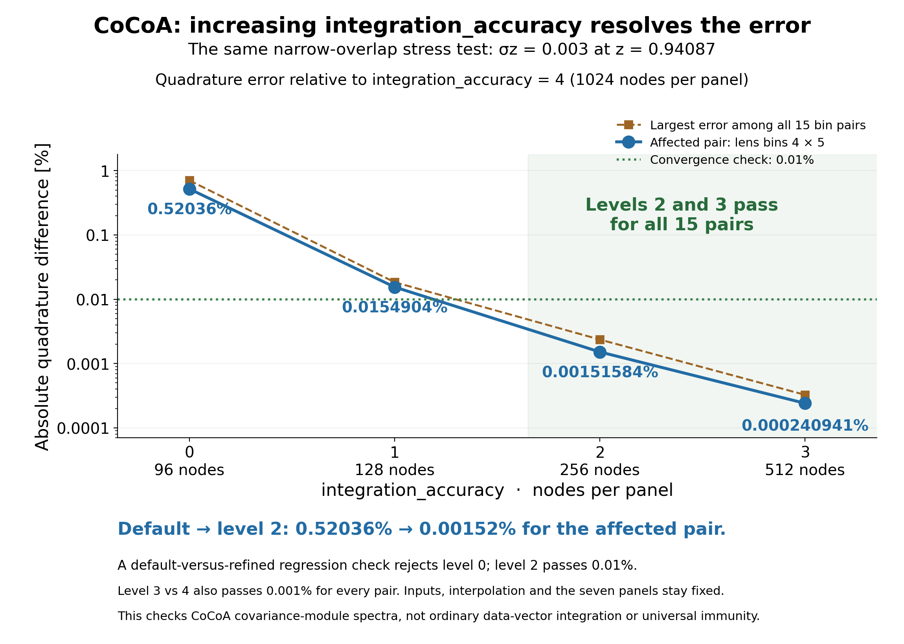
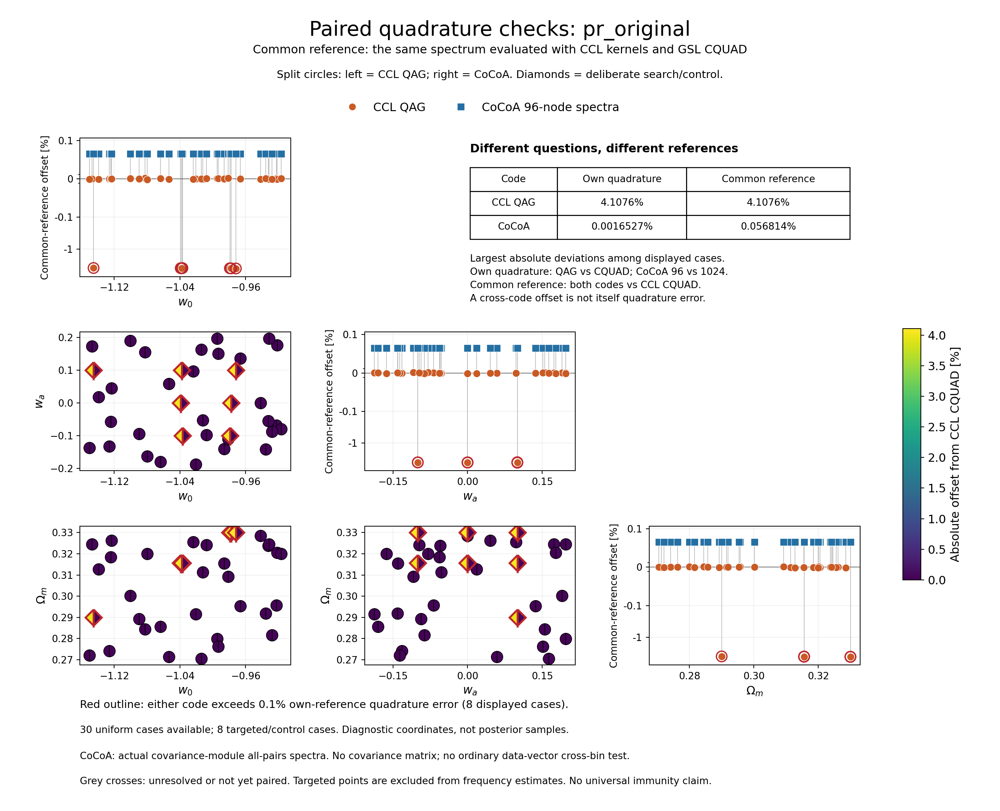

# CCL and CoCoA: paired Limber quadrature checks

This diagnostic tests the reported **QAG false-success mechanism**: two
embedded integration estimates can agree while both miss part of a narrow
redshift overlap. It extends the [archived single-case reproduction](../limber_false_success/)
with prescribed cosmology samples and separately labeled targeted searches.
The paired campaign is complete: 60 uniform input/cosmology cases, the
original failure control, seven further targeted cosmologies and three
targeted narrow-population cases. Results below are for CCL 3.3.3 / GSL 2.7
and the recorded CoCoA core `959bb1d` with 11,993 power-grid nodes.

## Results

The [main comparison README](../../README.md#ccl_qag) contains the measured
errors, convergence ladder and native timing tables.

- **Uniform sample:** 0/30 primary errors above 0.01% in either code, for
  each family. Each 95% Wilson interval is 0–11.35%; the families share
  cosmologies and are not 60 independent samples.
- **Node-guided cosmology search:** seven additional successful QAG
  returns with 3.966–4.108% error; CoCoA's own quadrature change stays
  below 0.00162% in those cases.
- **Narrow-population search:** QAG underestimates the three selected
  spectra by 30.70%, 58.52% and 78.75%. All return success after 41 calls.
- **CoCoA stress failure:** the narrowest population also produces a
  0.52036% default-to-refined change. `integration_accuracy=2` reduces
  that to 0.00152%, passing a 0.01% check across all 15 pairs. Levels 3/4
  agree within 0.001% across all pairs; the three saved regression checks pass.
- **Native timing:** CQUAD costs 1.05–1.09× QAG over 15 pairs × 26
  multipoles in two tested cosmologies. At the exact incorrect single-point
  returns it costs 2.93× and 5.32×. These are warmed angular-spectrum
  timings, not full covariance or MCMC runtimes.



The complete [result archive](results/20261007/publication_manifest.json)
records input/source hashes, accepted references, unsuccessful controls and
the preserved failed search attempt. The [timing archive](timing_results/20261007/summary.json)
includes nine interleaved batch samples per method and separate unmodified
QAG controls. Production source code is unchanged.

### Targeted cosmologies

All rows use the original distributions and CAMB PPF. They were selected
by a search, so their counts do not estimate failure frequency.

| w₀ | wₐ | Ωₘ | QAG error | CoCoA 96 → 1024 change |
|---:|---:|---:|---:|---:|
| −1.1451270843 | 0.1 | 0.2900 | −3.96626% | −0.001613% |
| −1.0369782766 | −0.1 | 0.3156 | −3.99602% | −0.001605% |
| −1.0389273987 | 0.0 | 0.3156 | −4.02246% | −0.001605% |
| −1.0379182507 | 0.1 | 0.3156 | −4.04948% | −0.001609% |
| −0.9791868487 | −0.1 | 0.3300 | −4.04806% | −0.001602% |
| −0.9777639303 | 0.0 | 0.3300 | −4.07706% | −0.001609% |
| −0.9719411756 | 0.1 | 0.3300 | −4.10755% | −0.001606% |



### Redshift-overlap atlas

Each distinct input/pair is drawn once, with both codes' measured spectra
and their own quadrature checks. Fixed redshift distributions do not move
when cosmology changes; their distance mapping does.

| Figure | Input/bin pairs |
|---|---|
| [Page 1](figures/20261007/overlap_error_atlas_01.png) | Narrow width 0.003: 1×1, 1×2, 1×3, 1×4 |
| [Page 2](figures/20261007/overlap_error_atlas_02.png) | Narrow width 0.003: 1×5, 2×2, 2×3, 2×4 |
| [Page 3](figures/20261007/overlap_error_atlas_03.png) | Narrow width 0.003: 2×5, 3×3, 3×4, 3×5 |
| [Page 4](figures/20261007/overlap_error_atlas_04.png) | Narrow width 0.003: 4×4, 4×5, 5×5; width 0.01: 4×5 |
| [Page 5](figures/20261007/overlap_error_atlas_05.png) | Width 0.03: 4×5; original 4×5; uniform shared peak 1×2 and 2×2 |
| [Page 6](figures/20261007/overlap_error_atlas_06.png) | Uniform shared peak: 2×3 and primary 4×5 |

The comparisons distinguish two quantities:

- **Quadrature error:** CCL QAG versus checked CQUAD, and CoCoA's default
  96-node rule versus its 1024-node refinement, checked against 512 nodes.
- **Cross-code offset:** both codes versus the same CCL-CQUAD spectrum. This
  includes remaining kernel and interpolation differences; it is not purely
  an integration error.

CoCoA's tested path is its **covariance-module all-pairs angular spectra**.
This study computes neither covariance matrices nor ordinary data-vector
cross-bin spectra. A finite set of passing cases does not establish immunity.

## Sampling and reference checks

The fixed design uses 30 seeded uniform cosmologies in each of two input
families, sharing the same cosmologies between families. The primary spectrum
is lens bins 4 × 5 at multipole 355.655882. The synthetic family adds a 15%
common narrow population to each original bin while keeping its broad support.
All new survey cosmologies use CAMB's PPF dark-energy treatment; the separately
labeled original failure control retains the upstream fluid treatment.

Frequency tables report the declared denominator, exclusions and Wilson
95% intervals. **The known 4.02% error is an error amplitude, not a failure
rate.** Node-guided searches and secondary pairs selected by a QAG/spline
screen are excluded from the uniform-sample frequency denominator.

Some split-QAG reference controls report `GSL_EROUND` at the tighter requested
accuracy. Their values and unsuccessful statuses are retained. Supplementary
checks use two successful CQUAD evaluations at a tighter tolerance, on the
whole interval and two independent halves. Reference records explicitly say
whether successful split-QAG controls also support the result. An unsuccessful
QAG control is never relabeled as a pass.

See the [sampling and acceptance protocol](PLAN.md) and the immutable run
configuration for the precise ranges, input-grid checks and reference tolerances.

## Reproduce the accuracy study

Use the separate **CCL 3.3.3 / GSL 2.7** runtime documented in the
[original QAG diagnostic](../limber_false_success/README.md#reproduce-the-numerical-case),
following the [TJPCov comparison environment recipe](https://github.com/vivianmiranda/tjcovbenchmark).
The recorded CCL runtime has Python 3.12.13; it is separate from this
repository's older PR #1296 data-vector installation. Check that
`pyccl.__version__` is `3.3.3` before running this study. Use the normal
activated CoCoA environment for CoCoA steps. Run numerical stages sequentially
and use a new output folder for a fresh campaign.

**Step 1️⃣:** Create the fixed sample and redshift inputs.

```bash
python diagnostics/limber_failure_survey/scripts/prepare.py --output work/limber_failure_survey_20261007
```

**Step 2️⃣:** Evaluate the three CCL pilot cases.

```bash
python diagnostics/limber_failure_survey/scripts/run_batch.py --engine ccl --pilot --output work/limber_failure_survey_20261007
```

**Step 3️⃣:** In the CoCoA environment, evaluate the same pilot cases.

```bash
python diagnostics/limber_failure_survey/scripts/run_batch.py --engine cocoa --pilot --output work/limber_failure_survey_20261007
```

**Step 4️⃣:** After checking the pilot references, run the full CCL sample.

```bash
python diagnostics/limber_failure_survey/scripts/run_batch.py --engine ccl --uniform --resume --output work/limber_failure_survey_20261007
```

**Step 5️⃣:** In the CoCoA environment, run the paired sample.

```bash
python diagnostics/limber_failure_survey/scripts/run_batch.py --engine cocoa --uniform --resume --output work/limber_failure_survey_20261007
```

**Step 6️⃣:** Collect saved comparisons and explicit exclusions.

```bash
python diagnostics/limber_failure_survey/scripts/summarize.py --output work/limber_failure_survey_20261007
```

**Step 7️⃣:** Generate paired figures from the saved measurements.

```bash
python diagnostics/limber_failure_survey/scripts/plot_paired.py --output work/limber_failure_survey_20261007
```

The triangle panels show diagnostic parameter coordinates, **not posterior
samples or confidence contours**. Split markers show both measured codes;
red outlines identify cases exceeding the stated within-code error threshold.
The overlap atlas draws each distinct input/pair once and places its CCL and
CoCoA results alongside it. Changing cosmology does not change a fixed input
redshift distribution, although it changes the distance mapping.

Targeted search commands are in [the study protocol](PLAN.md). Add their
`summary.json` paths using repeated `--targeted-summary` arguments when plotting.
The `collect_publication.py` collector verifies saved fingerprints and paired
values before creating a fresh archive. Large generated shared-power NPZs stay
local; their metadata and hashes are retained, and `run_ccl.py` can regenerate
them. They must not be described as included archive files.

## Reproduce the narrow-input convergence check

After the width-0.003 search and its paired reference checks have finished,
use the normal CoCoA environment. This changes quadrature only, with
`accuracy_boost=1` throughout. The public integration levels 0–4 map to
96/128/256/512/1024 nodes per panel; `accuracy_boost=5` is not a covariance
CLI setting.

**Step 1️⃣:** Evaluate all five public integration levels.

```bash
python diagnostics/limber_failure_survey/scripts/run_cocoa.py --integration-ladder --output work/limber_failure_survey_20261007/targeted/narrow_width_0p003 --case peak_0p003_0
```

**Step 2️⃣:** Verify that the default is rejected and the refined result passes.

```bash
python diagnostics/limber_failure_survey/scripts/check_integration_ladder.py --output work/limber_failure_survey_20261007/targeted/narrow_width_0p003 --case peak_0p003_0
```

**Step 3️⃣:** Save the Slack-ready convergence figure.

```bash
python diagnostics/limber_failure_survey/scripts/plot_integration_convergence.py --output work/limber_failure_survey_20261007/targeted/narrow_width_0p003 --case peak_0p003_0
```

The default rejection is expected evidence of underresolution, not a passing
convergence result. Fixed inputs can require more nodes; the comparison with
a refined calculation is the check. Table/interpolation convergence is separate.

## Native integrator timing scope

The [timing runner](scripts/time_native_integrators.py) calls public native
CCL `angular_cl`, with [a process-local macOS shim](scripts/native_timing_shim.c)
switching only its GSL integration call. Both use relative tolerance 1e-4.
The C integrand is unchanged and no Python callback enters the measured loop.
The timing does not represent a released CCL CQUAD API or PR #1313's extra
split-QAG checks. Read each saved `timing.json` for workspace, warm-up,
thread, batching, baseline and reference scopes. Never preload this diagnostic
into a production calculation.

The accepted runs verify the native OpenMP thread count after setup, preserve
all statuses, match unmodified QAG bitwise and retain the original startup/
workspace-check attempts locally. No failed harness attempt enters the table.
