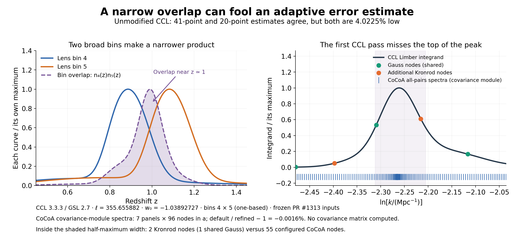

# CCL Limber false-success diagnostic

The [main comparison README](../../README.md#ccl_qag) explains the result.
This archive preserves the completed 2026-10-07 investigation and its
reproduction scripts. It is separate from the October 1–2 PR #1296
data-vector comparison.

| Recorded component | Version or commit |
|---|---|
| CCL | 3.3.3, unmodified installed package |
| GSL | 2.7 |
| CCL-side runtime | Python 3.12.13, NumPy 2.4.3, SciPy 1.17.1 |
| Machine | Apple M2 Pro, macOS 13.7.5 |
| Frozen PR #1313 input/helper revision | `8978d57e02e07e6557428ff50e134f3f21d70ab9` |
| CoCoA core | `959bb1d9fb54deafa6fe934c0327054bdede8a5e` |
| CoCoA LSST Y1 interface | `c187522125986ad181985c39143aeebbaad50a61` |

The cosmology has Omega_c = 0.2664, Omega_b = 0.0492, h = 0.6727,
n_s = 0.9645, sigma8 = 0.831, w_a = 0 and massless neutrinos. Only w_0
changes. The frozen five-bin input has 500 redshift samples and a 30%
outlier fraction; its [source description](inputs/limber_outlier_tomography.txt)
records the Binny configuration. Number-counts tracers have no RSD or
magnification, with constant bin bias 1.05 / D(a_bin).

## Evidence and scope

- [root_spike.json](results/root_spike.json): native CCL QAG and spline;
  direct GSL QAG with 1/2/4/8 subdivisions; direct GSL CQUAD; fixed-rule
  diagnostics. The callbacks evaluate CCL's own kernels and power
  interpolator, with its native tracer integration bounds. CQUAD here is
  a diagnostic call, not an added CCL 3.3.3 public integration option.
- [trigger_scan.json](results/trigger_scan.json): 41 neighboring cosmologies
  and controlled geometry/power swaps. [endpoint_controls.json](results/endpoint_controls.json)
  changes the quadrature-node alignment at a fixed cosmology.
- [cocoa_convergence.json](results/cocoa_convergence.json): three cosmologies,
  26 multipoles and five integration settings, with all saved spectra
  in `results/cocoa_case*_level*.npz`. The covariance-module calculation
  contains 15 galaxy pairs; the ordinary data-vector calculation contains
  only five auto-spectra and includes RSD. Integration levels 3 and 4 both
  use 1024 nodes in the ordinary data-vector routine, so their equality
  is not an independent refinement of that path.
- [study_summary.json](results/study_summary.json): original result and
  source hashes, preserved unchanged. [archive_manifest.json](archive_manifest.json)
  identifies the permanent files and the scripts adapted for portable
  paths. The three original 7.8 MB shared-power exports are regenerable
  with `export_ccl_cases.py`; their original hashes remain recorded.
  Only their background columns needed for the figure are also stored
  in `results/plot_geometry.npz`.

Within-code quadrature refinements hold the power interpolation fixed.
Absolute CoCoA–CCL spectrum differences are not interpreted as quadrature
errors. No covariance matrix, parameter derivative or Fisher inference
was computed in this diagnostic.



[Cosmology scan](figures/qag_trigger.png) ·
[All 96 nodes and weights](figures/narrow_overlap_sampling.png) ·
[Printable sampling figure](figures/narrow_overlap_sampling.pdf)

## Check the archive without running a cosmology code

From the repository root, use a Python environment with NumPy. These steps
only verify saved artifacts and regenerate figures from saved arrays.

**Step 1️⃣:** verify hashes and recompute the reported numerical differences.

```bash
python diagnostics/limber_false_success/scripts/verify_archive.py
```

**Step 2️⃣:** regenerate the narrow-overlap plot (Matplotlib is also needed).

```bash
python diagnostics/limber_false_success/scripts/plot_overlap.py
```

**Step 3️⃣:** regenerate the annotated 96-point-rule plot.

```bash
python diagnostics/limber_false_success/scripts/plot_overlap_sampling.py
```

**Step 4️⃣:** regenerate the cosmology-scan plot.

```bash
python diagnostics/limber_false_success/scripts/plot_trigger.py
```

New figures go to the ignored `work/limber_false_success_rerun/figures/`;
the saved archive is not overwritten. `--results` and `--output` select
different input and output folders.

## Reproduce the numerical case

Use the separately installed **CCL 3.3.3 / GSL 2.7** environment used for
the TJPCov comparison, following its [environment recipe](https://github.com/vivianmiranda/tjcovbenchmark).
Do not replace the PR #1296 installation used by the older data-vector
study. The new portable entry points were syntax-checked and their data
paths audited during packaging; the numerical evidence comes from the
original completed runs, not a second campaign.

**Step 1️⃣:** select a new output directory, from the repository root.

```bash
export QAG_DIAGNOSTIC_OUTPUT="$PWD/work/limber_false_success_rerun"
```

**Step 2️⃣:** evaluate the saved failing cosmology and independent interval splits.

```bash
python diagnostics/limber_false_success/scripts/reproduce.py
```

This uses the saved w_0 = -1.0389272675840322. The precise accidental
crossing can shift with compiler or dependency versions. If the failure
does not recur, `find_first_panel.py` scans for initial-rule crossings and
`reproduce.py --w <crossing>` checks one; a crossing alone does not prove
an inaccurate result. Each script has a ten-minute alarm. The GSL library
is located in the active runtime; set `GSL_LIBRARY` explicitly if needed
to use the same library as CCL.

**Step 3️⃣:** repeat the local cosmology scan and endpoint controls.

```bash
python diagnostics/limber_false_success/scripts/diagnose_trigger.py
```

**Step 4️⃣:** export the three CCL cosmologies for the separate CoCoA checks.

```bash
python diagnostics/limber_false_success/scripts/export_ccl_cases.py
```

The exporter writes linear/nonlinear power in CoCoA units, distance and
growth arrays, and the frozen distributions. It does not replace either
code's production cosmology setup. In a second terminal, activate CoCoA
with `start_cocoa.sh`, enter this repository, and set the same absolute
`QAG_DIAGNOSTIC_OUTPUT` path. The LSST Y1 covariance interface must be built
and importable.

**Step 5️⃣:** run the 15 CoCoA checks sequentially, in fresh processes.

```bash
python diagnostics/limber_false_success/scripts/run_cocoa_checks.py
```

This executes cases 0–2 and integration levels 0–4, saves the actual node
geometry for case 1, and recomputes the convergence report. It preserves
existing files by refusing a directory with completed CoCoA outputs.
No higher integration level is used.

## Upstream provenance

The frozen input and the unmodified helper in `vendor/` came from
[CCL PR #1313](https://github.com/LSSTDESC/CCL/pull/1313), pinned to the
revision above. The helper's cosmology, tracer and integrand functions
are reused; its standalone Simpson study is not run or reported here.
The [CCL license](vendor/LICENSE_CCL) is retained. The diagnostic applies
native GSL routines to those CCL evaluations and separately calls the
unmodified CCL `angular_cl` API; no CCL function is replaced.
